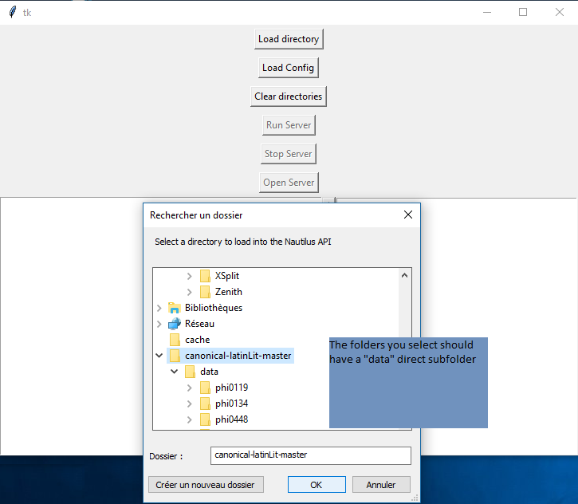

Nautilapp
=========

NautilApp provide a Graphical User Interface (GUI) that helps you run your own Nautilus API on your computer ! Download the exe and have fun !

- [NautilApp for Windows](dist/NautilApp.exe)
- [NautilApp for Mac](dist/NautilApp.app)
- [NautilApp for Ubuntu](dist/NautilApp.app)

## How to use

1. First, download the application for your own environment
2. Download at list one corpus (Example : [Perseus Canonical Latin Literature](https://github.com/PerseusDL/canonical-latinLit/archive/master.zip)), unzip it#
3. Open the Application
4. 
5. 
6. 
7. 
    1. [Go to http://localhost:5000 if you want to browse the text in the raw reading environment](http://localhost:5000)
    2. [Go to http://localhost:5000/api/cts if you want to browse the text in the CTS API](http://localhost:5000/api/cts)

## Developers

The GUI has been quickly developed and I am not a really good and efficient GUI designer. This repository is pretty much open to any PR that would make the following better : 

1. Add more option on how to run the application (Choose the IP to run on, choose the Port to run on)
2. Fix bugs that I would have missed
3. Enhance the GUI that is really crappy (While keeping the same functions and not have to worry about that)
4. Provide an automatic cross-system builer through Travis or the likes
